# Himasakta-Front-End

<div align="center">
  
  
  
  
  
  
  
  
</div>

English version of this documentation: coming soon.

## Landing page

Pratinjau landing page dapat dilihat di [sini](https://himasakta-frontend.vercel.app)
Nb: Tidak wajib melengkapi semua gambar tetapi sebaiknya dilengkapi.

1. Hero Image/Hero Section
   **Hero image** adalah bagian sampul atau gambar utama pada halaman website. Hero image berisi gambaran umum mengenai isi website yang pertama kali dilihat user. Gambar yang dipilih sebagai hero image adalah gambar yang paling menarik perhatian sekaligus mampu menyampaikan gambaran umum website. Untuk saat ini bagian ini statik atau tidak dapat diubah langsung. <br>
   > **Ukuran minimum gambar:**
   > lebar: >2000px, tinggi: >750px, (rekomendasi ukuran 2400px X 1500px, sebaiknya bukan hasil upscale)
   > tinggi di tampilan desktop: 750px, di tampilan mobile: 550px, lebar memnuhi layar (landscape)

<div align="center">
  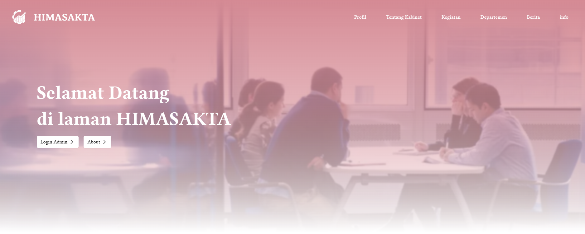
</div>

<br>

2. Profil Himpunan
   **Profil Himpunan** adalah bagian yang menjelaskan informasi umum Himasakta. Bisa diisi sejarah Himasakta dan apa dasar-dasar pendirian Himasakta dan sebagainya. Gambar dari profil himpunan juga harus menarik sekaligus mampu merepresentasikan Himasakta. Untuk saat ini bagian ini statik atau tidak dapat diubah langsung.
   > **Ukuran minimum gambar:**
   > lebar: >1600px, tinggi: >500px, (rekomendasi ukuran 2100px X 900px)
   > aspek rasio di desktop: 16:5, di tampilan mobile: 16:9 (landscape)

<div align="center">
  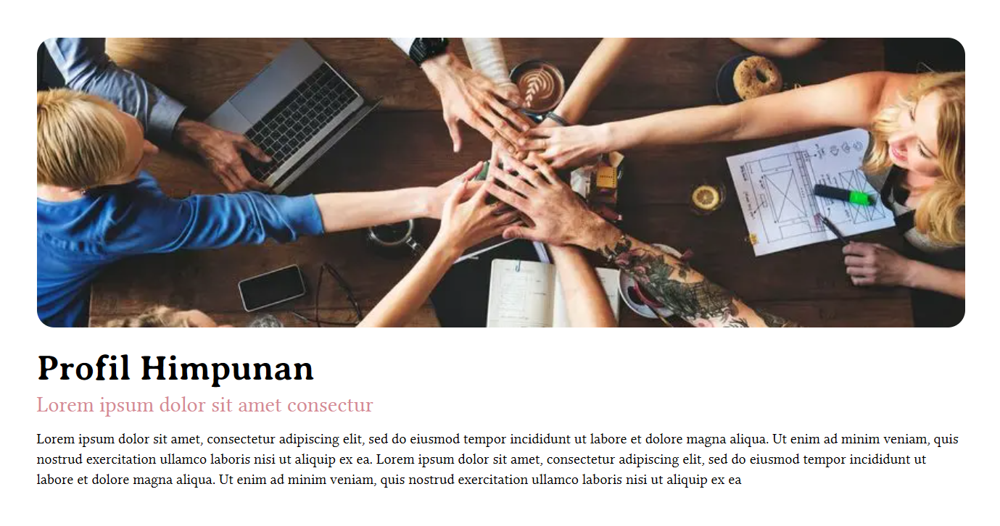
</div>

<br>

3. Informasi Kabinet
   **Informasi Kabinet** adalah bagian yang menjelaskan informasi kabinet yang sedang aktif saat ini. Bisa diisi deskripsi, tagline/jargon, dan visi-misi kabinet. Bagian ini dapat diubah melalui halaman admin nantinya.
   > **Ukuran minimum gambar:**
   > Lebar: >600px, tinggi: >800px, (rekomendasi ukuran 1200px X 900px)
   > Aspek rasio di desktop: 402px X 569px, di mobile: 16:12 (landscape)

<div align="center">
  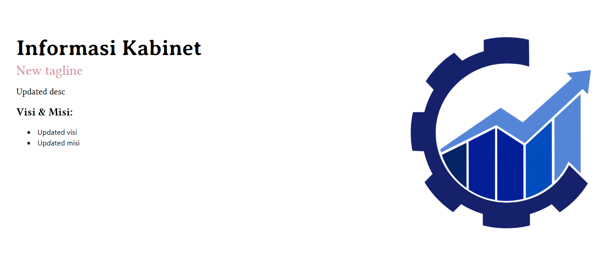
</div>

<br>

4. Organigram / Struktur Organisasi
   **Organigram** adalah gambar yang menjelaskan struktur organisasi pada kabinet aktif saat ini. Organigram harus memiliki ukuran besar dan terlihat jelas saat diperbesar. Bagian ini bisa diubah di halaman admin.
   > **Ukuran minimum gambar:**
   > Lebar: >1920px, tinggi: >1080px, (rekomendasi ukuran 2240px X 1260px, harus tajam / bukan hasil upscale)
   > Aspek rasio tetap di 16:9 (landscape) menyesuaikan ukuran layar

<div align="center">
  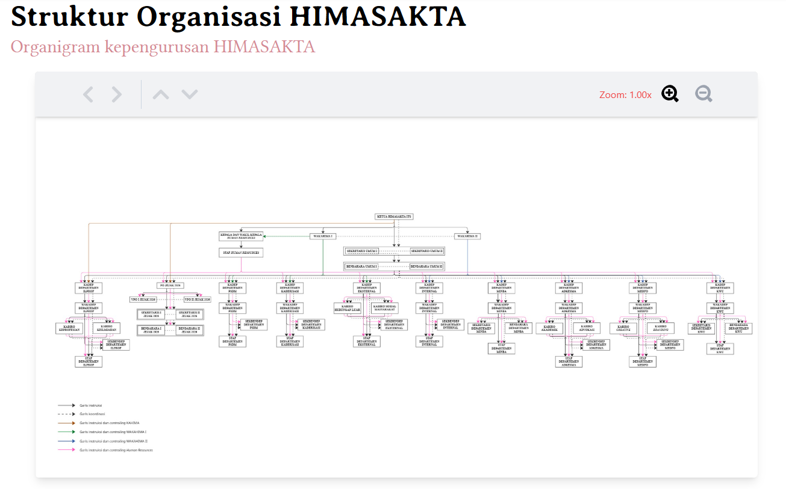
</div>

<br>

5. Get To Know
   **Get To Know** adalah kumpulan informasi kegiatan yang diadakan dalam satu bulan terakhir. Get to know dapat berisi 0-5 informasi kegiatan sekaligus sesuai data yang ada. Bagian ini bisa diubah di halaman admin.
   > **Ukuran minimum gambar:**
   > Lebar: >500px, tinggi: >500px, (rekomendasi ukuran 1000px X 1000px)
   > Aspek rasio tetap di 1:1 menyesuaikan ukuran layar

<div align="center">
  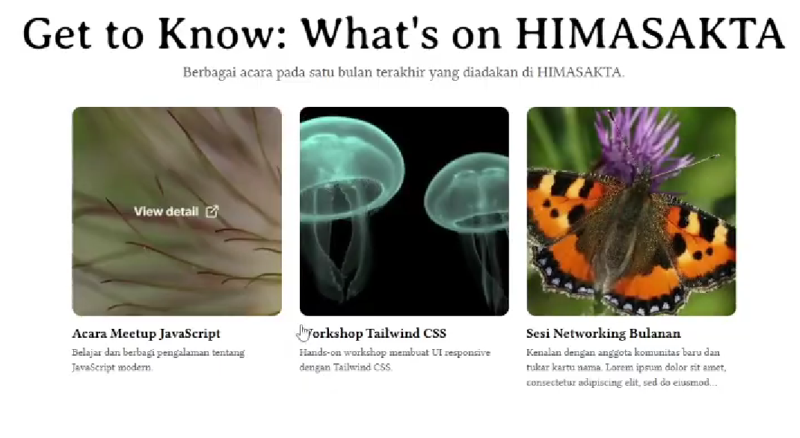 <br>
  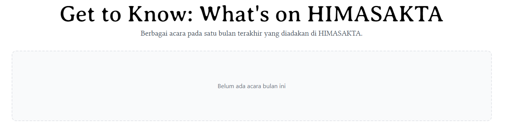
</div>

<br>

6. Informasi Departemen
   **Informasi Departemen** adalah kumpulan navigasi ke semua departemen Himasakta. Sementara bisa diisi 1-12 departemen (tidak boleh kosong). Bagian ini bisa diubah di halaman admin.
   > **Ukuran minimum gambar:**
   > Lebar: >1600px, tinggi: >900px, (Desain harus kompatibel dengan aspek rasio sekitar 7:1)
   > Aspek rasio berubah dari 6:1 hingga 7:1 menyesuaikan ukuran layar

<div align="center">
  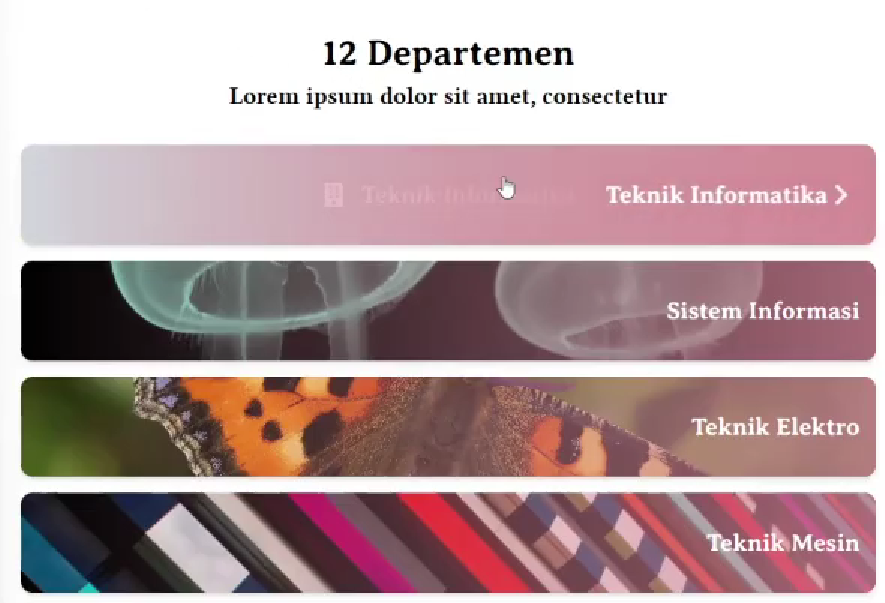 <br>
  <p>Layar hp/tab</p>
  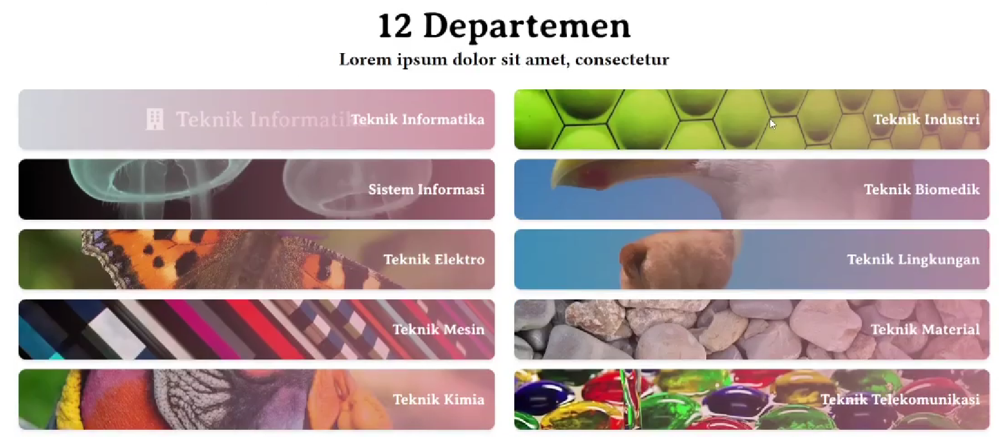
  <p>Layar desktop</p>
</div>

7. Informasi Berita
   **Informasi Berita** adalah kumpulan navigasi ke 12 berita terbaru di himasakta. Bagian ini bisa menampung 0-12 berita dengan 4 berita dalam 1 slide. Bagian ini bisa diubah di halaman admin.
   > **Ukuran minimum gambar:**
   > Lebar: >1280px, tinggi: >720px, (Ukuran tidak terlalu bermasalah, sebaiknya landscape)
   > Aspek rasio: 16:9

<div align="center">
  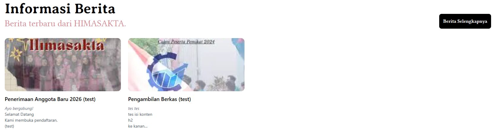 <br>
  <p>Jika sedikit</p>
  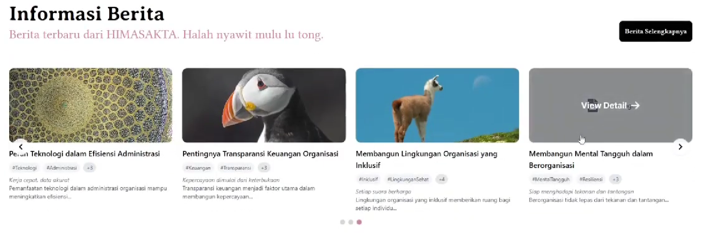 <br>
  <p>Jika banyak</p>
  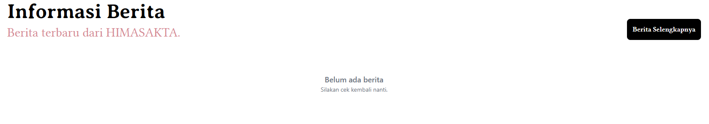
  <p>Jika kosong</p>
</div>

## Deskripsi

### 🛠 Arsitektur Teknis

1. Desain Sistem & Styling
   Modern Color Space: Menggunakan HEX config di tailwind config dan modern oklch inline styling.
   Responsive Design: Implementasi orientasi perangkat menggunakan custom variants (landscape: dan portrait:) untuk memastikan pengalaman optimal di perangkat mobile.

2. Standar Pengembangan
   Strict TypeScript: Penggunaan interface dan type yang ketat untuk data departemen, berita, dan struktur kabinet guna meminimalisir runtime error.

Code Style: Menggunakan 2-space indentation untuk keterbacaan yang lebih bersih.
Component-Driven Development: Memisahkan komponen modular di src/components untuk reusability. Dilakukan sekitar 60%, dapat dikembangkan lebih lanjut.

### 🚀 Fitur Utama, Modul, dan Teknologi

| Kategori     | Teknologi                       | Keterangan                              |
| ------------ | ------------------------------- | --------------------------------------- |
| Framework    | Next.js                         | React framework untuk fullstack SSR/CSR |
| Library UI   | React, Lenis, Markdown Renderer | Core library frontend                   |
| Language     | TypeScript / JavaScript         | Type safety & scripting                 |
| Styling      | Tailwind CSS / CSS              | Utility-first styling                   |
| Icons        | Lucide React Icons              | UI icons                                |
| State Mgmt   | React Hooks                     | Manage state                            |
| API Handling | Fetch / Axios                   | HTTP requests (JSON)                    |
| Routing      | Next.js Router (src/ based)     | File-based routing                      |
| Build Tool   | Turbopack / Webpack             | Bundler bawaan Next                     |
| Linting      | ESLint / Biome                  | Code quality control                    |
| Formatting   | Prettier                        | Code formatting                         |
| Deployment   | Vercel                          | Hosting testing frontend                |
| Container    | Docker                          | CI/CD and environtment conrol           |

Keterangan versi lebih lanjut di: [sini](./package.json)

#### 📰 News & Article Engine

Dynamic Filtering: Pengguna dapat menyaring berita berdasarkan tag (#event, #pengumuman) secara instan.

Search & Sort: Algoritma pencarian berbasis judul dan pengurutan data berdasarkan tanggal rilis.

Interactive Slider: Homepage dilengkapi dengan slider berita yang mendukung auto-play, navigasi dotted, dan responsivitas tinggi.

#### 🏛 Department & Academic Hub

Department Navigator: Komponen navigasi khusus yang mendukung horizontal scrolling untuk daftar departemen yang panjang.

Resource Library: Integrasi link ke direktori akademik seperti:

Bank Soal & Referensi

Silabus Mata Kuliah

Bank Referensi Organisasi

#### 👔 Cabinet Profile

Information Hub: Menampilkan narasi Visi & Misi, tagline kabinet, serta galeri foto kegiatan.
Organigram: Menampilkan struktur organisasi dari pengurus inti hingga anggota departemen.
Galeri: Menampilkan dokumentasi kabinet.

#### 📂 Struktur Proyek

```
src/
├── app/ # Next.js App Router (Pages & Layouts)
├── components/ # UI Components (Atomic Design)
│ ├── common/ # Button, Input, Badges
│ ├── layout/ # Navbar, Footer, Sidebar
│ └── shared/ # NewsCard, DeptCard, Slider
├── hooks/ # Custom React Hooks (e.g. useOrientation)
├── lib/ # Utils, Fetchers, Constant Data
└── types/ # TypeScript Interfaces & Types
```

#### 💻 Panduan Instalasi

Clone & Install

Bash
git clone https://github.com/HIMASAKTA-DEV/himasakta-frontend.git
cd himasakta-frontend
npm install
Environment Variables
Buat file .env.local dan sesuaikan dengan API endpoint (jika ada):

Cuplikan kode
NEXT_PUBLIC_API_URL=your_api_url
Development Mode

Bash
npm run dev
Aplikasi akan berjalan di http://localhost:3000.

#### 🤝 Kontribusi

Kami sangat menghargai kontribusi dari anggota HIMASAKTA. Harap perhatikan hal berikut sebelum melakukan Pull Request:

Pastikan kode menggunakan 2-space indentation.

Gunakan TypeScript untuk setiap file baru.

Gunakan variabel warna dari config Tailwind (hindari hardcoded HEX).

**Note:** Repo ini masih dalam tahap pengembangan aktif untuk modul CMS dan integrasi Dashboard Admin.
